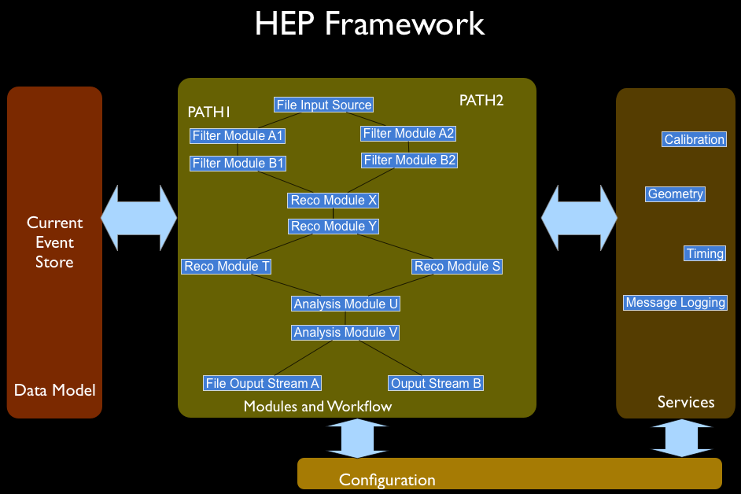

title: The art framework
subtitle: a tutorial introduction
author: Marc Paterno & Jim Kowalkowski
footer: The <b>art</b> tutorial
copyright: The <b>art</b> tutorial

generator: slideshow

What art?
=====================

The **art** Event Processing Framework coordinates event processing via configurable, pluggable modules (e.g. reconstruction, filtering, and analysis) that add data to and retrieve data from events, supporting a programming model that separates algorithm and data. An event is one unit of data, an interaction, or period of collected data.

The art framework
=================

This tutorial introduces the most important elements of the **art** framework. It is a work in progress.

Key concepts of the art framework
=================================

Data-related
------------

* **Event Data Model**: Representation of the data that an experiment collects, all derived information,
  and historical records necessary for reproduction of results.

* **Data Products**: Experiment defined classes that represent detector signals, reconstruction results,
  simulation, etc..

* **Event**: A collection of data products associated with one time window, the smallest
   unit of detector data collection to be processed.

* **SubRun**: A period of data collection in which operating conditions do not change.

* **Run**: A period of data collection, defined by the experiment.

* **Provenance**: Metadata describing how data products were produced.

Processing-related
------------------

* **Configuration**: Structured documents describing all processing aspects of a single job
  including setting of parameters and workflow specification.

* **Module**: An object (in C++) that “plugs into" a processing stream and performs a specific task on
  units of data obtained using the Event Data Model, independent of other running modules.

* **Event Processor**: An object that utilizes a configuration document to dynamically schedule sequences
  of modules to process data using the event data model.

* **Services**: A global facility that is dependent on the state of the application and that can
  be accessed from any module.

* **Process Name**: User-assigned name representing the kind of processing that a job is affiliated
  with, such as reconstruction, testing, filtering.
  
EDM: the Event Data Model
=========================

* Library for organizing, navigating, and persisting data processed by the experiment

* Organization is hierarchical: *Run* / *SubRun* / *Event*

* Processing happens one Event at a time

* The EDM at the lowest level appears as a small database holding data
  products generated (collected or derived) for the associated data
  taking period

* Modules perform queries to find existing data objects and do inserts
  to store new data products associated with this Event

Data Products
=============

* Almost all C++ objects can be stored into an *Event* (the objects must not contain bare pointers)

* Most products will be **collections**

* Navigation classes provide the replacement for bare pointers

* There are many ways to "label" the products to allow for later queries by processing elements

* Each data product has a configurable label that can be used in downstream processing queries

* The build system must be told which classes are stored in the *Event*, and must generate "dictionaries"
  which are used to support persistency in Root files.

Modules
=======

* These are the user-written processing elements of the system. Each has its own configuration.

* Each module processes one *Event* at a time.

* Four types of modules:
  1. **Producers** - request data products, insert new data products
  2. **Filters** - request data products and can alter further processing using return values
  3. **Analyzers** - request data products, do not create new ones; make histograms, etc.
  4. **Output** - store data products to files (provided by framework)

Sources
=======

* **Source** - provide the stream of Events (e.g. from file)

* New ones be provided by experiment without new **art** release

* Different classes for different tasks:

  * *RootInput*: reads **art** format Root files
  * *NOvARawInputSource*: experiment-specfic source that reads binary DAQ files (provided by framework group)
  * *EmpyEvent*: creates *Events* containing no products (used, e.g., in simulation)

Filter Interface
================

    class EDFilter {
      // explicit EDFilter(ParameterSet const&)

      virtual bool filter(Event&) = 0
      virtual void reconfigure(ParameterSet const&)

      virtual void beginJob()
      virtual void endJob()
      virtual bool beginRun(Run &)
      virtual bool endRun(Run &)
      virtual bool beginSubRun(SubRun &)
      virtual bool endSubRun(SubRun &)

      virtual void respondToOpenInputFile(FileBlock const& fb)
      virtual void respondToCloseInputFile(FileBlock const& fb)
      virtual void respondToOpenOutputFiles(FileBlock const& fb)
      virtual void respondToCloseOutputFiles(FileBlock const& fb)
    }

Analyzer Interface
==================

    class EDAnalyzer {
      // explicit EDAnalyzer(ParameterSet const&)

      virtual void analyze(Event const&) = 0
      virtual void reconfigure(ParameterSet const&)

      virtual void beginJob()
      virtual void endJob()
      virtual bool beginRun(Run const &)
      virtual bool endRun(Run const &)
      virtual bool beginSubRun(SubRun const &)
      virtual bool endSubRun(SubRun const &)

      virtual void respondToOpenInputFile(FileBlock const& fb)
      virtual void respondToCloseInputFile(FileBlock const& fb)
      virtual void respondToOpenOutputFiles(FileBlock const& fb)
      virtual void respondToCloseOutputFiles(FileBlock const& fb)
    }

Services
========

* *TFile*: Controls the ROOT directories (one per module) and manages the histogram file.
* *Timing*: Tracks CPU and wall clock time for each module for each event
* *Memory*: Tracks increases in overall program memory on each module invocation
* *FloatingPointControl*: Allows configuration of FPU hardware “exception” processing
* (*RandomNumberService*): Manages the state of a random number stream for each interested module
* (*MessageFacility*): Routes user-emitted messages from modules based on type and severity to destinations

Access interface
----------------

        #include "art/Framework/Services/Optional/TFileService.h"
        ...
        art::ServiceHandle<art::TFileService> tfs;
        fFinalVtxX = tfs->make<TH1F>("fFinalVtxX",
                                     "Circe Vertex X; Xfit-Xmc (cm); Events",
                                     200, -50.0, 50.0);

FHiCL configuration of services
-------------------------------

        services:
        {
          TFileService:
          {
            fileName: "tfile_output.root"
          }

          user:
          {
            # experiment- or user-defined plugin service
          }
          ...
        }

FHiCL Job Configuration
=======================

        #include "job/geometry.fcl"
        #include "job/cosmicgen.fcl"

        process_name: CosmicsGen

        services: {
          TFileService: {
            fileName: "cosmics_hist.root"
          }
          user: @local::ndos_services
        }

        source: {
          module_type: EmptyEvent
          maxEvents:  10 # Number of events to create
        }

        outputs: {
          out1: {
            module_type: RootOutput
            fileName: "cosmics_gen.root"
          }
        }

        physics: {
          producers: {
            generator: @local::cosmics_ndos
            geantgen:  @local::standard_geant4
            photrans:  @local::standard_photrans
            daq:       @local::standard_rsim

	  } # things will be added here

          simulate: [ generator, geantgen, photrans, daq ]
          stream1:  [ out1 ]
          trigger_paths: [simulate]
          end_paths:     [stream1]
        }

        # Existing elements can be replaced ...
        services.user.Geometry:         @local::fd_geo
        services.TFileService.fileName: "mccheckout.root"

        outputs.out1.fileName: "sim_cosmics.root"

Configuration: Sample of FHiCL include file
===========================================

        BEGIN_PROLOG
        std_cosmictrack:
        {
         module_type:     CosmicTrack
         Debug:           false
         ClusterInput:    "slicer"     # input module of time slices
         DHitGood:        10.          # Maximum distance from the fit
                                       # line for a hit to be considered
                                       # part of the track.  In cm,
                                       # roughly 1.5 cells.
         ZGapAllowed:     10           # Maximum distance from the fit
                                       # line for a hit to be considered
                                       # part of the track, in planes.
         Ticks:           64000        # number of clock ticks to read out
                                       # one "spill"
         TickWindow:      64           # Size of window in which to look
                                       #for hits to call something an event
         MinHitsInWindow: 10           # Minimum number of hits needed in
                                       # a window to call something an event
         MinSig:          22.          # Minimum signal for a CellHit::PECorr()
                                       # to have to be used in a track
        }
        END_PROLOG

Output Filtering
================

* Any output module can be configured to write out only those events passing a given *trigger path*.
* The parameter set that configures the output module uses a parameter _SelectEvents_ to control the output,
  as shown in the example below

      # this is only a fragment of a full configuration ...
      physics:
      {
        pathA: [ ... ]  # producers and filters are put in this path
        pathB: [ ... ]  # other producers, other filters are put in this path

        outpath: [ pathAwriter ] # output modules and analyzers are put in this path

        trigger_paths: [ pathA, pathB ] # declare that these are "trigger paths"
        end_paths: [ outpath ]          # declare this is an "end path"
      }

      outputs:
      {
        pathAwriter:
        {
          module_type: RootOutput
          fileName: "pathA_events.root"
          SelectEvents: { SelectEvents: [ pathA ] } # Only events passing pathA will be written
        }
      }

nova Command Line Arguments
============================

* Everything has reasonable default
* Values on the command line override values in the configuration document

        $> nova -h
        nova <options> [config-file]:
          -T [ --TFileName ] arg   File name for TFileService.
          -c [ --config ] arg      Configuration file.
          -e [ --estart ] arg      Event # of first event to process.
          -h [ --help ]            produce help message
          -n [ --nevts ] arg       Number of events to process.
          --nskip arg              Number of events to skip.
          -o [ --output ] arg      Event output stream file.
          -s [ --source ] arg      Source data file (multiple OK).
          -S [ --source-list ] arg file containing a list of source files to read, one
                                   per line.
          --trace                  Activate tracing.
          --notrace                Deactivate tracing.
          --memcheck               Activate monitoring of memory use.
          --nomemcheck             Deactivate monitoring of memory use.

Event Product Access
====================

        bool CirceFit::filter(art::Event& evt)
        {
          // Pull the calibrated hits out of the event
          typedef std::vector<rb::CellHit> input_t;
          art::Handle<input_t> hitcol;
          evt.getByLabel(fInputCalHits, hitcol);
        ...
        std::auto_ptr<ProngList> prongcol( new ProngList );
        evt.put(prongcol);
        return true;
      }

New Product Definition
======================

        <lcgdict>
         <class name="arttest::Simple"/>
         <class name="arttest::SimpleDerived"/>

         <class name="std::vector<arttest::SimpleDerived>"/>
         <class name="art::Wrapper<std::vector<arttest::SimpleDerived> >"/>
        </lcgdict>
